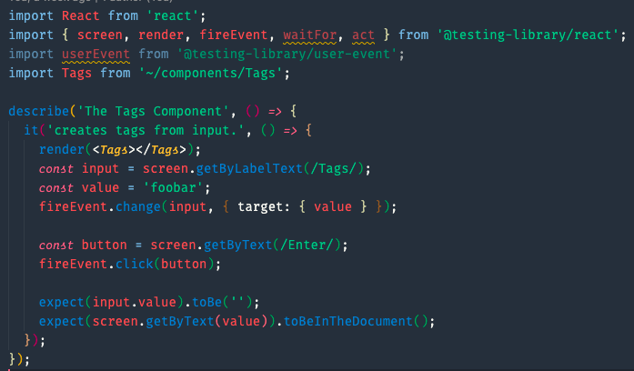

# Testing in Javascript ☕ and React ⚛️

---

# Why Test ? 🤔

---

# Why Test ? 🤔
## **Confidence**

---

# Why Test ? 🤔
## Confidence
## **Improves code quality**

---

# Why Test ? 🤔
## Confidence
## Improves code quality
## **Doubles as documentation**

---

# Why Test ? 🤔
## Confidence
## Improves code quality
## Doubles as documentation
## **Catch bugs sooner, fewer reach production.**

---

# What to Test ✅
* Logic heavy functions
* Stateful components
* Resolved bugs
* Expected requirements

---

# What **Not** to Test 🙅‍♀️
* Network requests
* Storage
* Stateless components
* Trivial functions
* Implementation details of child components.

---

# When to Test ⏱
## _AKA_ Non-Dogmatic **TDD**

---

---

# Why Test First ? 🥇

---

# Why Test First ? 🥇
## **Tests will be _realistic_.**

---

# Why Test First ? 🥇
## Tests will be realistic.
## **Design your _ideal_ API.**

---

# Why Test First ? 🥇
## Tests will be realistic.
## Design your ideal API.
## **Failing tests _guide_ you.**

---

# Why Test First ? 🥇
## Tests will be realistic.
## Design your ideal API.
## Failing tests guide you.
## **Refactor with _confidence_.**

---

# Why Test First ? 🥇
## Tests will be realistic.
## Design your ideal API.
## Failing tests guide you.
## Refactor with _confidence_.
## **Tests will actually get written. 😉**

---

# Testing first isn't always realistic
## Be pragmatic

---

# Tools 🛠

---

# Tools 🛠
## **Jest**
### Test Runner and assertion library.

---

# Tools 🛠
## **React Testing Library**
### Rendering and DOM testing library.

---

# Tools 🛠
## **User Event Library**
### Browser Interaction library.

---

# Structure of a Test 🏗️
## Setup
## Do action
## Assert expectation

---

---

# Demonstration 📽️

